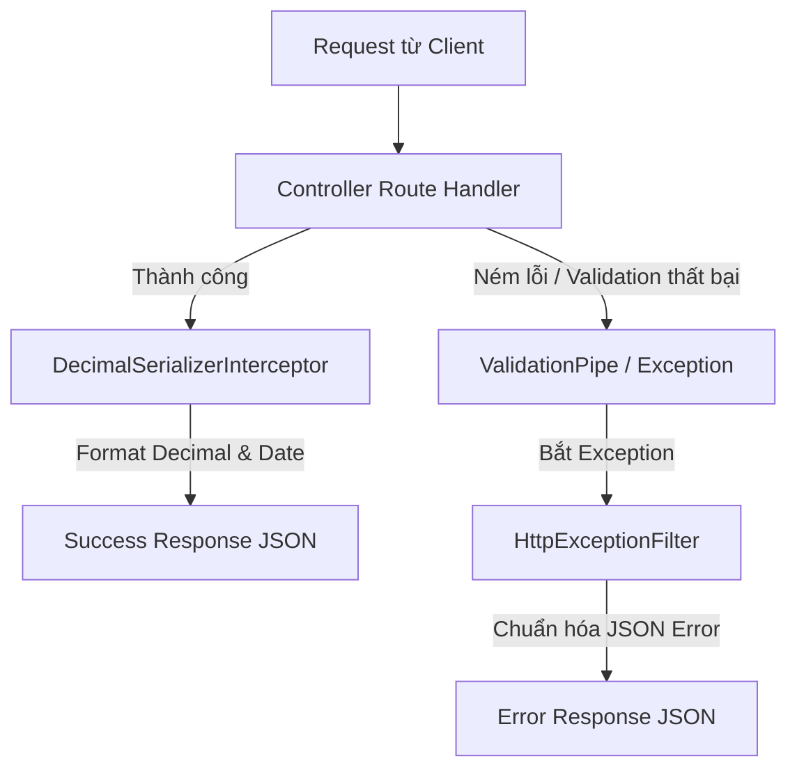

# Quy trình Chuẩn hóa cấu trúc Response (Success & Error) trong Backend TCCT

Dự án TCCT quản lý và định dạng toàn bộ dữ liệu phản hồi (Response) gửi về Client thông qua sự phối hợp của ba thành phần chính: **`HttpExceptionFilter`**, **`DecimalSerializerInterceptor`**, và **`ValidationPipe`**.

---

## 1. Tổng quan Luồng xử lý Response



---

## 2. Xử lý Phản hồi Lỗi (Error Response)

Toàn bộ các ngoại lệ (Exceptions) ném ra trong hệ thống đều đi qua bộ lọc global **`HttpExceptionFilter`** để trả về cấu trúc lỗi đồng nhất dưới dạng:

```json
{
  "code": "MÃ_LỖI",
  "message": "Mô tả lỗi ngắn gọn",
  "errors": [...] // Mảng chứa chi tiết lỗi (chỉ có khi là lỗi Validation)
}
```

### 2.1. Đăng ký Global Filter
Filter được khai báo toàn cục tại [app.module.ts](file:///d:/tcct/backend/src/app.module.ts):
```typescript
{
  provide: APP_FILTER,
  useClass: HttpExceptionFilter,
}
```

### 2.2. Cơ chế xử lý chi tiết của [HttpExceptionFilter](file:///d:/tcct/backend/src/common/filters/http-exception.filter.ts)
* **Lỗi Nghiệp vụ (`CustomException`)**: Lấy thuộc tính `errorCode` truyền vào exception làm trường `code` (ví dụ: `ROUTE_NOT_FOUND`).
* **Lỗi Validation từ DTO**: Nếu lỗi là do validate input dữ liệu đầu vào thông qua class-validator, filter sẽ tự động chuyển:
  * `code` thành `'VALIDATION_ERROR'`
  * `message` thành `'Validation failed'`
  * `errors` chứa chi tiết các điều kiện validation bị vi phạm.
* **Lỗi HTTP chuẩn**: Nếu lỗi là các HTTP exception mặc định khác của NestJS, filter sẽ tự động chuyển đổi sang mã code tương ứng:
  * `401 Unauthorized` $\rightarrow$ `code: 'UNAUTHORIZED'`
  * `403 Forbidden` $\rightarrow$ `code: 'FORBIDDEN'`
  * `404 Not Found` $\rightarrow$ `code: 'NOT_FOUND'`
  * Các lỗi khác mặc định sẽ trả về `code: 'HTTP_ERROR'`.

---

## 3. Xử lý Phản hồi Thành công (Success Response)

Đối với các request xử lý thành công, backend hiện tại **chưa sử dụng** một global wrapper interceptor nào để đóng gói dữ liệu dạng `{ code: 'SUCCESS', data: ... }`. Thay vào đó, dữ liệu trả về từ Controller được gửi trực tiếp cho client sau khi đi qua **`DecimalSerializerInterceptor`**.

### 3.1. Đăng ký Global Interceptor
Được cấu hình toàn cục tại [app.module.ts](file:///d:/tcct/backend/src/app.module.ts):
```typescript
{
  provide: APP_INTERCEPTOR,
  useClass: DecimalSerializerInterceptor,
}
```

### 3.2. Cơ chế hoạt động của [DecimalSerializerInterceptor](file:///d:/tcct/backend/src/common/interceptors/decimal-serializer.interceptor.ts)
Interceptor này tự động duyệt qua cấu trúc dữ liệu trả về (Success Data) để convert:
* **Prisma Decimal**: Chuyển đổi toàn bộ các đối tượng Decimal (kiểu số thập phân chính xác cao của Prisma) thành kiểu `number` tiêu chuẩn của Javascript bằng phương thức `.toNumber()`.
* **Date**: Chuyển đổi các instance `Date` sang chuỗi định dạng ISO chuẩn (`.toISOString()`).

---

## 4. Kiểm tra và Ràng buộc Dữ liệu Đầu vào (Validation)

Để đảm bảo dữ liệu đầu vào luôn khớp định dạng mong muốn trước khi đi vào Controller xử lý, dự án sử dụng **`ValidationPipe`** cấu hình global tại [main.ts](file:///d:/tcct/backend/src/main.ts):

```typescript
app.useGlobalPipes(
  new ValidationPipe({
    whitelist: true,          // Tự động loại bỏ các thuộc tính không được khai báo trong DTO
    forbidNonWhitelisted: true, // Ném lỗi BadRequestException nếu request chứa thuộc tính lạ không có trong DTO
    transform: true,           // Tự động convert kiểu dữ liệu của request payload sang instance Class DTO tương ứng
  }),
)
```

Nếu một request vi phạm ràng buộc DTO (ví dụ thiếu email, sai định dạng số điện thoại,...), `ValidationPipe` sẽ ném ra ngoại lệ và được `HttpExceptionFilter` định dạng thành response JSON lỗi như mô tả ở Mục 2.2.
